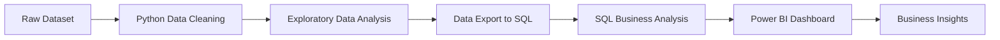

# 🛒 Customer Behaviour Analysis

## 📌 Project Overview

Customer Behaviour Analysis is an end-to-end Data Analytics project focused on analyzing customer purchasing patterns, revenue trends, discount effectiveness, customer segmentation, and business performance in a retail/e-commerce environment.

This project combines:

- 🐍 Python for Data Cleaning & EDA
- 🗄 SQL for Business Analysis
- 📊 Power BI for Interactive Dashboarding

The primary objective is to transform raw transactional data into actionable business insights that help improve customer retention, optimize marketing campaigns, and maximize revenue generation.

---

# 🚀 Business Problem

How can a retail company understand customer purchasing behavior to:

- Increase revenue
- Improve customer retention
- Optimize marketing campaigns
- Understand product demand
- Analyze seasonal trends
- Identify high-value customers

---

# 📂 Dataset Information

| Attribute | Details |
|---|---|
| Domain | Retail / E-Commerce |
| Dataset Type | Structured (Tabular) |
| Level | Customer Transaction Level |
| Records | 5000+ Customers |
| Features | Numerical + Categorical |

---

# 📋 Dataset Features

### Numerical Features
- Age
- Purchase Amount
- Previous Purchases
- Review Rating

### Categorical Features
- Category
- Item Purchased
- Gender
- Payment Method
- Shipping Type
- Season
- Subscription Status
- Discount Applied

---

# 🛠 Tech Stack

| Tool | Purpose |
|---|---|
| Python | Data Cleaning & EDA |
| Pandas | Data Manipulation |
| NumPy | Numerical Operations |
| SQL | Business Query Analysis |
| MySQL / SQL Server | Database Management |
| Power BI | Dashboard Development |
| Jupyter Notebook | Analysis Workflow |

---

# 🔄 Project Workflow



---

# 🧹 Data Cleaning & Preprocessing

## ✔ Cleaning Steps Performed

- Handled missing values
- Corrected inconsistent category mappings
- Removed duplicate records
- Standardized column names
- Product-level rating imputations
- Created SQL-friendly schema
- Exported cleaned data to SQL database

---

# 📌 Advanced Cleaning Logic

### Size Column Handling
- Electronics → "Not Applicable"
- Accessories → "Not Applicable"
- Footwear → "Free Size"
- Clothing → Filled using mode

### Review Rating Imputation
- Filled missing ratings using product-level mean

### Purchase Amount Handling
- Missing purchase amounts replaced using mean value

### Previous Purchases
- Missing values replaced with 0

### Column Standardization
- Converted column names to lowercase
- Replaced spaces with underscores

---

# 📊 Exploratory Data Analysis (EDA)

## Key Analysis Areas

- Revenue Trends
- Customer Demographics
- Purchase Behavior
- Category Performance
- Discount Impact
- Seasonal Sales
- Customer Loyalty
- Payment Preferences

---

# 🗄 SQL Business Analysis

## 🔍 Business Questions Solved

### Revenue Analysis
- Which category generates the highest revenue?
- Which products are bestsellers?

### Customer Insights
- Who are loyal vs returning vs new customers?
- Which age group contributes most revenue?

### Marketing Analysis
- Do discounts increase purchase value?
- Which customers respond to discounts?

### Subscription Analysis
- Do subscribed customers spend more?
- Are repeat buyers likely to subscribe?

### Operational Insights
- Shipping type performance
- Payment method analysis
- Seasonal revenue analysis

---

# 📈 Key Insights

## 💰 Revenue by Category

| Category | Revenue |
|---|---|
| Electronics | $486K |
| Accessories | $194K |
| Clothing | $183K |
| Footwear | $111K |
| Outerwear | $18K |

---

# 🔥 Major Findings

### Electronics Dominate Revenue
- Electronics generated the highest revenue at approximately $486K

### Discounts Increase Purchase Value
- Discounted purchases averaged $219
- Non-discounted purchases averaged $182

### Subscribers Spend More
- Subscribers spend approximately 63% more than non-subscribers

### High-Value Customer Group
- Customers aged 51+ contributed the highest revenue

### Loyal Customers Drive Revenue
- Loyal customers formed the majority of repeat purchases

---

# 👥 Customer Segmentation

| Segment | Customer Count |
|---|---|
| Loyal Customers | 3085 |
| Returning Customers | 1354 |
| New Customers | 561 |

---

# 📊 Power BI Dashboard Features

## Dashboard KPIs

- Total Customers
- Total Spend
- Average Spend
- Revenue by Gender
- Revenue by Category
- Seasonal Revenue
- Payment Method Distribution
- Revenue by Age Group
- Shipping Analysis
- Product Performance

---

# 📌 Dashboard Insights

## Revenue Distribution
- Male Customers → $391K
- Female Customers → $352K
- Other → $251K

## Top Locations
- New York
- Los Angeles
- Phoenix

## Seasonal Performance
- Spring generated highest revenue
- Fall generated lowest revenue

## Shipping Analysis
- Express shipping customers showed higher average spending

---

# 📷 Dashboard Preview

## Main Dashboard


---

# 📁 Project Structure

```bash
Customer-Shopping-Behaviour-Analysis/
│
├── datasets/
│   ├── cleaned_customer_data.csv
│   └── customer_shopping_behavior.csv
│
├── notebooks/
│   └── Customer_Behaviour_Analysis.ipynb
│
├── sql/
│   └── BUSINESS_INSIGHTS.sql
│
├── powerbi/
│   └── Customer_behaviour_analysis.pbix
│
├── reports/
│   ├── Report.pdf
│   ├── Overview.pdf
│   └── Problem_Statement.pdf
│
└── README.md
```

---

# ⚡ How to Run This Project

## 1️⃣ Clone Repository

```bash
git clone https://github.com/deepak10281/Customer-Shopping-Behaviour-Analysis.git
```

---

## 2️⃣ Install Dependencies

```bash
pip install pandas numpy matplotlib sqlalchemy pymysql
```

---

## 3️⃣ Run Jupyter Notebook

```bash
jupyter notebook
```

---

## 4️⃣ Execute SQL Queries

Import cleaned dataset into MySQL/SQL Server and run:

```sql
BUSINESS_INSIGHTS.sql
```

---

## 5️⃣ Open Power BI Dashboard

Open the following file:

```bash
Customer_behaviour_analysis.pbix
```

---

# 📚 Learning Outcomes

Through this project, I gained hands-on experience in:

- Real-world data cleaning
- SQL business analysis
- Customer segmentation
- Revenue analysis
- Dashboard development
- Data storytelling
- Business intelligence reporting
- Data visualization best practices

---

# 📌 Key Business Takeaways

✅ Electronics category drives maximum revenue

✅ Discount strategies improve purchase value

✅ Loyal customers contribute major repeat revenue

✅ Subscription programs significantly increase customer spending

✅ Age group 51+ contributes the highest revenue share

✅ Seasonal sales trends can optimize inventory planning

---

# 👨‍💻 Author

## Deepak Malviya

📧 Email: deepakmalviya7604@gmail.com

🔗 LinkedIn: https://www.linkedin.com/in/deepak102825/

🔗 GitHub: https://github.com/deepak10281/Customer-Shopping-Behaviour-Analysis

---

# ⭐ Support

If you found this project useful:

⭐ Star this repository  
📢 Share feedback  
🤝 Connect with me on LinkedIn

---

# 📌 Project References

- Project overview and business objectives documented in uploaded reports 
- Business questions and analytical objectives defined in project problem statement 
- Complete EDA, SQL analysis, customer segmentation, and dashboard insights included in final report 
